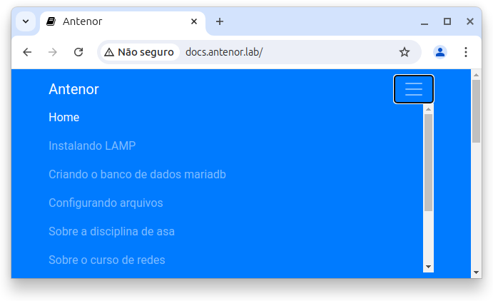

# Criação do site estático

O site que você se encontra:

Este site foi criado no laboratório de redes de computadores do IFRN PARNAMIRIM, sob a orientação do Professor Jurandy Soares, com a proposta de documentar todo o processo de criação e aprendizagem da disciplina. 
