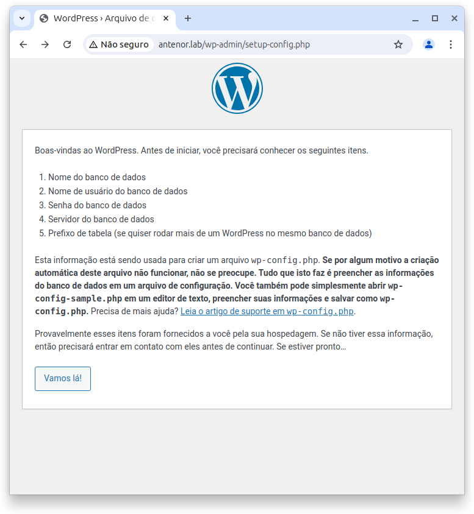
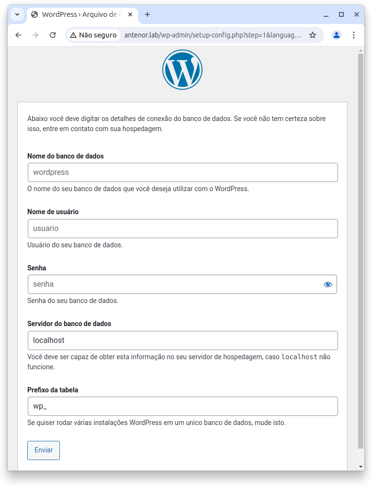
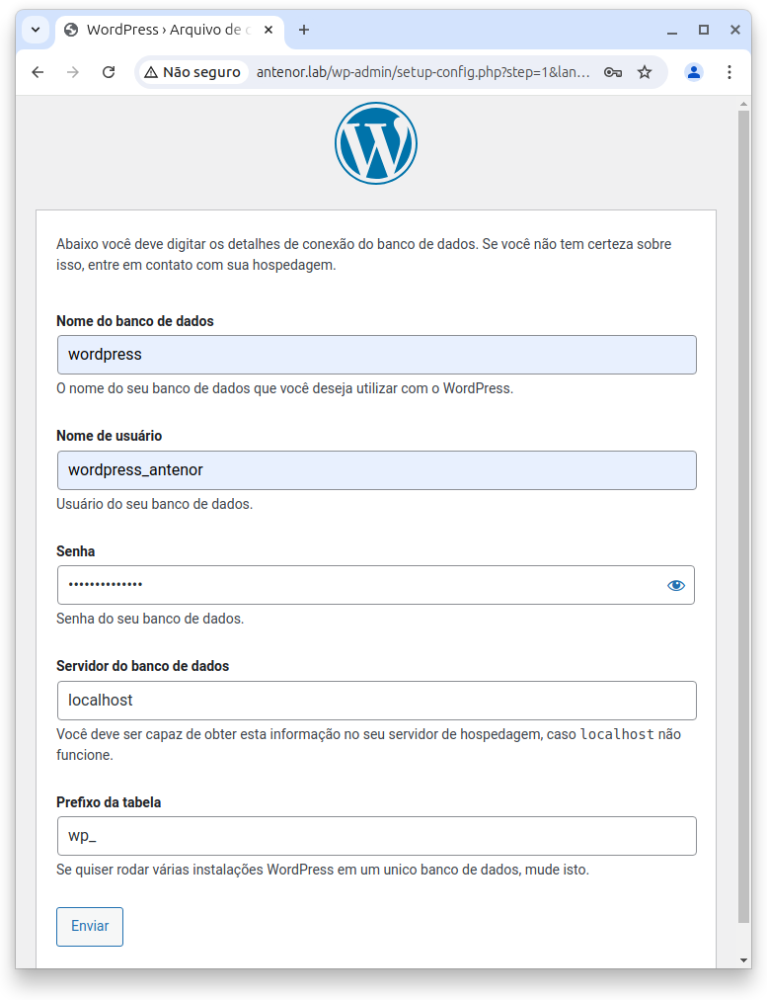
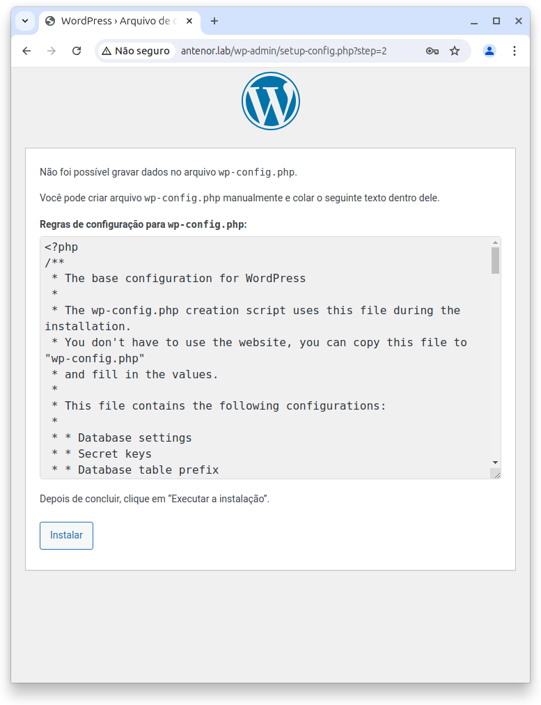
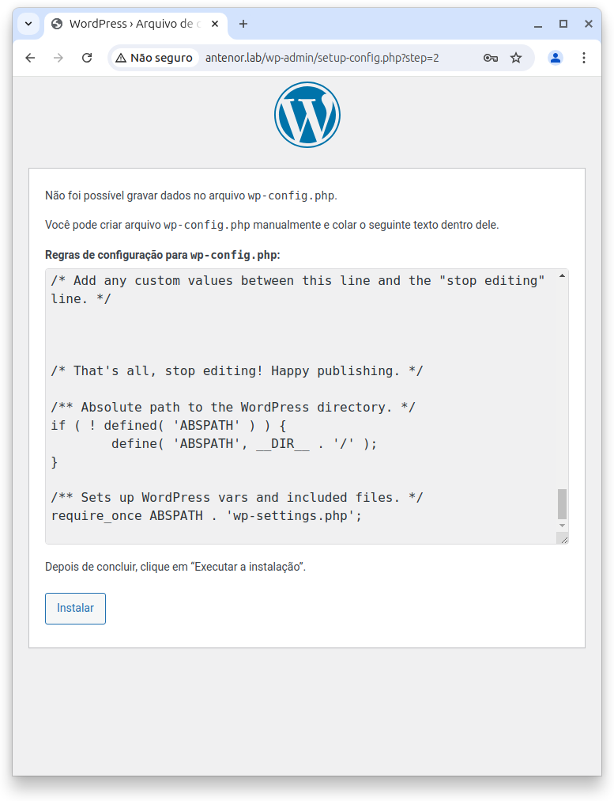
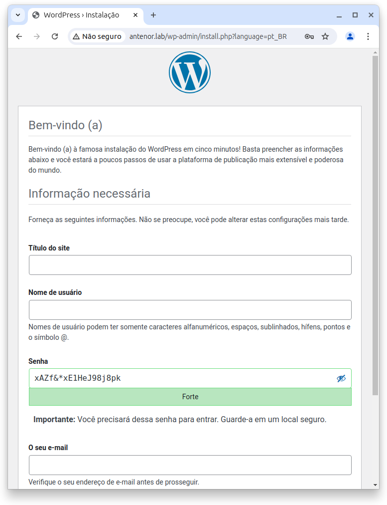
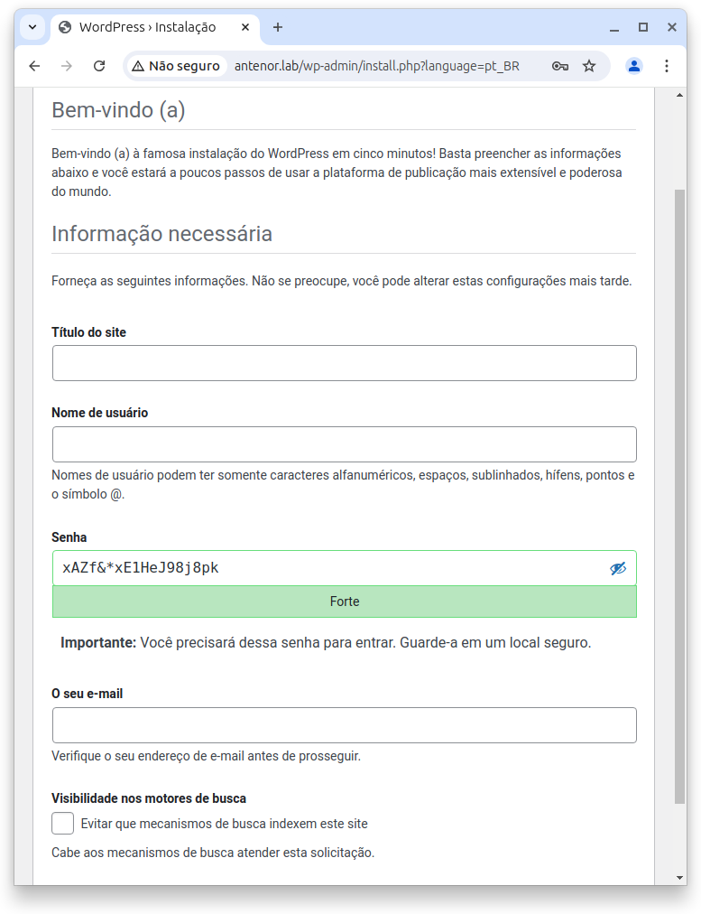
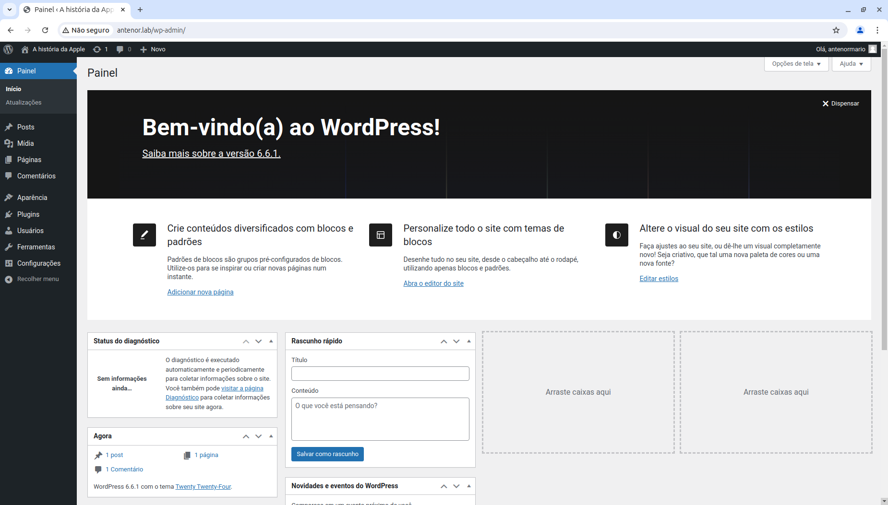

# Configuração e Instalação do Wordpress

# Requisitos

Hospedagem Web e Domínio: Você precisa de um serviço de hospedagem e um nome de domínio. Muitos provedores de hospedagem oferecem instalações do WordPress com um clique.

Servidor com PHP e MySQL: O WordPress requer um servidor que suporte PHP e MySQL. Certifique-se de que seu servidor atenda a esses requisitos.

Acesso FTP ou Gerenciador de Arquivos: Você precisará de um cliente FTP (como FileZilla) ou acesso ao gerenciador de arquivos do seu painel de controle de hospedagem.

## Passos para a Instalação Manual
## 1. Baixar o WordPress

- Baixe o WordPress: Vá ao site oficial do WordPress e baixe a versão mais recente do WordPress.

## 2. Preparar o Servidor

## Crie um Banco de Dados MySQL:

- Acesse o painel de controle da sua hospedagem.
- Encontre a seção para criar bancos de dados MySQL.
- Crie um novo banco de dados e um usuário MySQL com todas as permissões para esse banco de dados.
- Anote o nome do banco de dados, o nome de usuário e a senha.

## 3. Upload dos Arquivos

- Descompacte o Arquivo: Descompacte o arquivo ZIP do WordPress que você baixou.
- Suba os Arquivos para o Servidor:
- Use um cliente FTP ou o gerenciador de arquivos do painel de controle da hospedagem.
- Envie todos os arquivos do WordPress para o diretório onde deseja instalar o WordPress (geralmente a pasta public_html ou www).

## 4. Configuração do WordPress

## Inicie o Processo de Instalação:

- Acesse seu site no navegador (por exemplo, www.seudominio.com).
- O WordPress detectará que não há um arquivo de configuração e irá iniciar o assistente de instalação.

## Preencha as Informações do Banco de Dados:

- Na tela de configuração, insira as informações do banco de dados que você criou anteriormente:

Nome do banco de dados
Nome de usuário
Senha
Servidor do banco de dados (geralmente localhost)

- Clique em “Enviar” e depois em “Executar a instalação”.

## Configure o WordPress:

- Na próxima tela, você precisará fornecer informações para configurar seu site:

Título do site
Nome de usuário
Senha
E-mail

- Após preencher esses detalhes, clique em “Instalar WordPress”.

## Acesso ao Painel de Administração

- Acesse o Painel de Administração:
  
Após a instalação, você verá uma mensagem de sucesso e poderá fazer login no painel de administração.

Acesse o painel de administração do WordPress, por exemplo: www.antenor.lab/wp-admin.

## Página de bem-vindo da instação do wordpress

## Detalhes de conexão do banco de dados

## Configuração para wp-config.php

## Fornecimento de informações como título, usuário, senha e e-mail

## Página de bem-vindo do adminstrador e editor do wordpress

