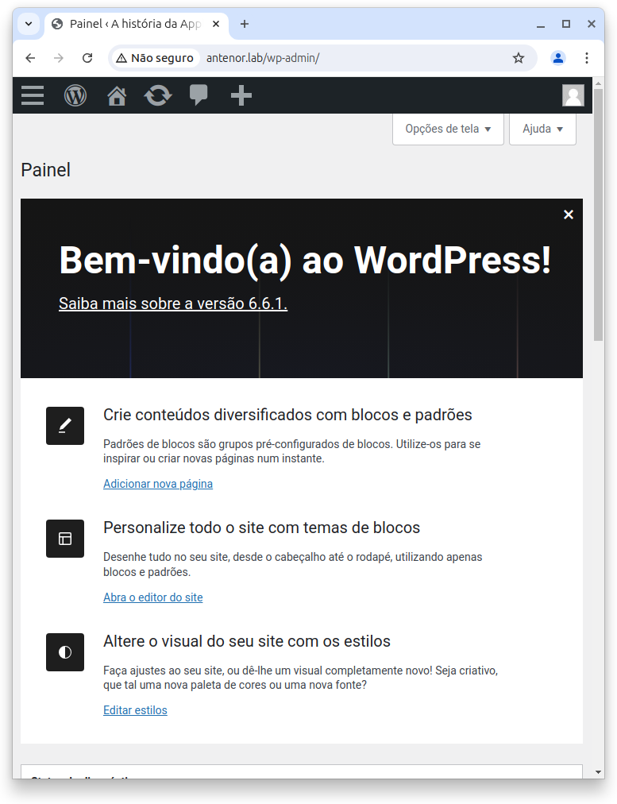

# Configuração e Instalação do Wordpress

## Página de bem-vindo da instação do wordpress

## Detalhes de conexão do banco de dados

## Configuração para wp-config.php

## Fornecimento de informações como título, usuário, senha e e-mail

## Página de bem-vindo do adminstrador e editor do wordpress

